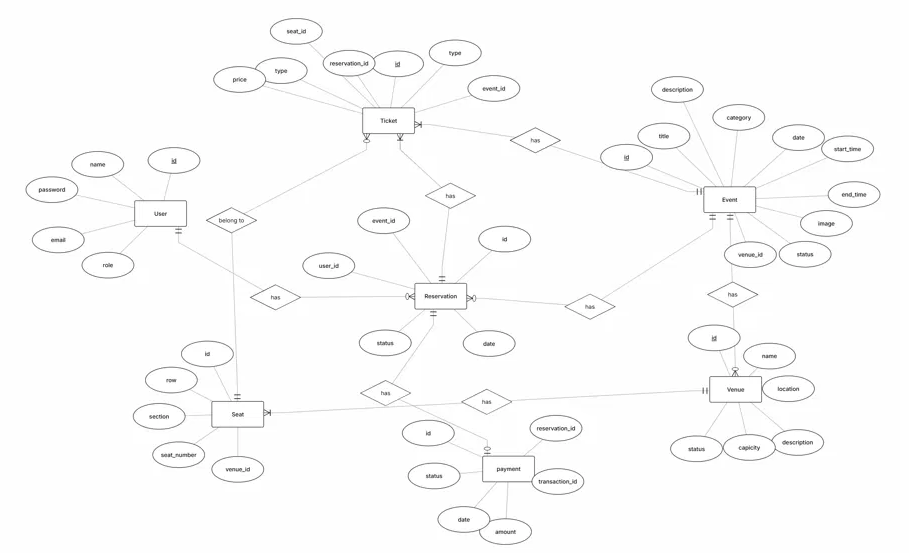

# Technical Event Ticketing & Reservation Platform

A backend-focused event ticketing and reservation platform built with **Node.js, TypeScript, Express, and PostgreSQL**.

> **Note:** This project's focus is the backend API and its data/business logic (transactional booking integrity, database-protected seat holds via atomic upsert/conflict handling, role-based access control). A minimal React/TypeScript client is included under `test-client/`. It is intentionally lightweight and exists primarily to exercise and demonstrate the backend API end-to-end.

## Project Overview

The platform models technical events, venues, physical seats, ticket categories, reservations, temporary seat holds, payments, and issued tickets.

The core booking flow is designed around database integrity and transactional behavior rather than treating a seat as permanently "taken".

## Main Features

- User registration and cookie-based authentication
- Access-token and refresh-token authentication
- Refresh-token rotation and revocation
- Customer/admin authorization
- Venue management
- Event management
- Venue schedule overlap protection
- Event-specific ticket pricing
- Venue seat management
- Seat types: regular, VIP, student, early bird
- Reservation creation and status management
- 10-minute temporary seat holds
- Event-specific seat availability
- Seat/ticket type compatibility validation
- Database-level protection against double-selling a seat for the same event
- Transactional payment processing
- Automatic ticket creation after accepted payment
- Customer reservation and ticket views
- Admin management interface

## Tech Stack

### Backend

- Node.js
- TypeScript
- Express
- PostgreSQL
- `pg`
- bcrypt
- JWT
- cookie-parser
- validator
- CORS

### Test Client

- React
- TypeScript
- Vite
- React Router

## Architecture

The backend follows a layered structure:

```text
Request
  ↓
Route
  ↓
Middleware
  ↓
Controller
  ↓
Service
  ↓
Model
  ↓
PostgreSQL
```

### Controllers

Handle request parsing, validation, HTTP status codes, and responses.

### Services

Contain business rules such as ownership, reservation status, seat type compatibility, event overlap checking, and transactional booking behavior.

### Models

Contain PostgreSQL queries and persistence logic.

### Middleware

- `authenticate` validates the access-token cookie.
- `authorize(role)` enforces role-based access.
- The global error middleware handles thrown `AppError` instances.

## Database Design

Core tables:

```text
users
venue
event
seat
reservation
payment
ticket
seat_hold
refresh_tokens
event_ticket_price
```

### Important relationships

```text
Venue 1 ──── N Event
Venue 1 ──── N Seat
User  1 ──── N Reservation
Event 1 ──── N Reservation
Reservation 1 ──── N Seat Hold
Reservation 1 ──── N Ticket
Event 1 ──── N Ticket
Event 1 ──── N Ticket Price
Seat 1 ──── N Tickets (across different events, over time)
```


A physical seat can be associated with tickets for different events over time; a seat can only have one ticket for a given event, because ticket uniqueness is scoped to `(event_id, seat_id)`.

## Booking Design

A seat is a **physical resource**, not a permanently available/unavailable database flag.

For a particular event, a seat is unavailable when:

```text
sold ticket exists
OR
active hold exists
```

A hold temporarily claims a seat for 10 minutes. When its `expires_at` is reached, the availability query stops treating the hold as active.

After a successful payment:

```text
Payment created
    ↓
Tickets created
    ↓
Seat holds deleted
    ↓
Reservation confirmed
```

All of the accepted-payment steps run inside one database transaction.

## Ticket Types and Seat Types

The system supports:

```text
regular
vip
student
early_bird
```

A seat has a `type`, and the requested ticket type must match the seat type before a hold can be created.

For example:

```text
VIP seat + VIP ticket          ✅
VIP seat + Regular ticket      ❌
Regular seat + Regular ticket  ✅
```

## Venue Scheduling Rule

The same venue can host multiple events, but draft/published events on the same date cannot overlap.

For example:

```text
10:00 → 12:00
12:00 → 14:00
```

is valid, while:

```text
10:00 → 12:00
11:00 → 13:00
```

is rejected.

## Test Client

A minimal React/TypeScript client (`test-client/`) is included to exercise and demonstrate the backend API end-to-end, including login, event browsing, seat holds, payment, and admin venue/event/seat/price management. It is intentionally lightweight and is not the focus of the project.

## API Documentation

The complete endpoint reference is in:

```text
docs/API.md
```

It documents authentication, authorization, request bodies, validation rules, query parameters, business rules, and the booking workflow.

## Local Setup

### 1. Install backend dependencies

From the backend project root:

```bash
npm install
```

### 2. Configure environment variables

Copy `.env.example` to `.env` and fill in your own values (PostgreSQL connection details and JWT secrets).

Do not commit `.env` to Git.

### 3. Create the PostgreSQL database

Run the schema located at:

```text
database/schema.sql
```

The project uses PostgreSQL for persistence.

### 4. Start the backend

Use the development script configured in `package.json`.

The backend is expected to run at:

```text
http://localhost:5000
```

### 5. Install test client dependencies

```bash
cd test-client
npm install
```

### 6. Start the test client

Use the Vite development script configured in the test client's `package.json`.

The test client is expected to run at:

```text
http://localhost:5173
```

The backend CORS configuration allows the test client's origin and credentials:

```text
http://localhost:5173
```

## Build / Verification

Backend build:

```bash
npm run build
```

Test client build:

```bash
cd test-client
npm run build
```

The project should pass both builds before release.

## Testing Completed During Development

The implemented workflow has been exercised manually through the test client and direct API calls, including:

- successful end-to-end booking
- rejected payment
- expired seat hold releasing the seat
- one seat cannot produce two tickets for the same event
- same venue with overlapping events is rejected
- same venue with non-overlapping events is allowed
- event-specific seat reuse across different events
- seat hold behavior when a seat is already held
- seat/ticket type mismatch protection
- admin venue/event/seat/price management

## Security and Integrity Highlights

- Passwords are hashed with bcrypt.
- Access and refresh tokens are delivered through HTTP-only cookies.
- Refresh tokens are stored hashed in the database.
- Refresh tokens are rotated during token refresh.
- Ownership checks prevent customers from accessing other users' reservations, payments, and tickets.
- Role middleware protects admin endpoints.
- Ticket prices are read from the database rather than trusted from the client.
- PostgreSQL uniqueness constraints protect against duplicate physical-seat assignments and duplicate event-seat sales.
- Accepted payment operations use a database transaction to prevent partial booking state.

## Project Structure

```text
├── database/
│   └── schema.sql
├── src/
│   ├── config/
│   ├── controllers/
│   ├── middleware/
│   ├── models/
│   ├── routes/
│   ├── services/
│   ├── types/
│   ├── schemas/
│   ├── utils/
│   ├── app.ts
│   └── index.ts
├── docs/
│   └── API.md
├── test-client/
│   ├── public/
│   ├── src/
│   ├── package.json
│   ├── package-lock.json
│   ├── tsconfig.json
│   └── README.md
├── .env.example
├── .gitignore
├── docker-compose.yaml
├── package.json
├── package-lock.json
├── tsconfig.json
└── README.md
```

## Portfolio Highlights

This project demonstrates practical backend engineering concepts rather than only CRUD endpoints:

- RESTful API design
- layered architecture
- PostgreSQL relational modeling
- authentication and authorization
- transactional business workflows
- database-protected seat holds (atomic upsert/conflict handling)
- event-specific pricing
- database constraints for integrity
- time-based resource availability
- customer/admin workflows
- Database Desgin
